# Entendimento do Negócio

## Matriz Oceano Azul

### Estratégia do Oceano Azul e Aplicação em Projetos Inovadores

A Estratégia do Oceano Azul, formulada por W. Chan Kim e Renée Mauborgne em seu influente livro de 2005, introduz uma abordagem revolucionária para competir no mercado. Diferente da competição acirrada em "oceanos vermelhos", mercados saturados onde as regras são bem estabelecidas e a concorrência é intensa, essa estratégia promove a criação ou descoberta de "oceanos azuis". Estes representam mercados inexplorados com imenso potencial para crescimento, onde a competição é irrelevante porque ainda não existem regras definidas.

### Oceano Vermelho versus Oceano Azul
- **Oceano Vermelho:** Refere-se aos mercados existentes que são altamente competitivos e muitas vezes saturados, o que limita o potencial de crescimento.
- **Oceano Azul:** Caracteriza-se pela inovação em mercados não explorados, permitindo às empresas definir novas regras, captar demandas inéditas e crescer de forma lucrativa.

### Importância da Estratégia do Oceano Azul
A relevância dessa estratégia se destaca por vários motivos:
- **Inovação com menos risco:** Motiva as empresas a explorar novos territórios em vez de se confinarem a espaços superpovoados.
- **Crescimento lucrativo:** Ao criar "oceanos azuis", as organizações podem gerar receitas substanciais e sustentáveis.
- **Diferenciação:** Oferece às empresas uma posição única no mercado, frequentemente a custos reduzidos, aumentando o valor percebido pelos consumidores.
- **Mudança de mentalidade:** Incentiva a priorização da inovação de valor sobre a competição direta.
- **Sustentabilidade:** Uma implementação bem-sucedida pode tornar uma empresa tão única que se torna desafiador para concorrentes replicarem suas estratégias.

### As Quatro Ações da Estratégia do Oceano Azul
Estas ações são ferramentas essenciais para desafiar as convenções setoriais e abrir novos espaços de mercado:
- **Reduzir:** Diminuir ou simplificar os elementos superdimensionados pela indústria para reduzir custos e otimizar recursos.
- **Eliminar:** Remover características consideradas padrão pela indústria mas que são desnecessárias para os consumidores, tornando a oferta mais enxuta.
- **Aumentar:** Intensificar aspectos que superam os padrões da indústria, elevando a qualidade ou o desempenho do produto para além das expectativas convencionais.
- **Criar:** Introduzir características inéditas no setor, atendendo a necessidades não satisfeitas e capturando novos segmentos de consumidores.

### Aplicação no Projeto do Tapete Sensorial
Neste contexto, nosso projeto visa desenvolver um tapete sensorial inovador destinado à terapia ocupacional de crianças com Transtorno do Espectro Autista (TEA). Incorporando as quatro ações, identificamos oito atributos chave para diferenciar nosso produto no mercado, criando um novo valor para terapeutas e pacientes, e posicionando o tapete como um recurso terapêutico essencial e único.

Essa estratégia alinhada ao nosso projeto não apenas propõe uma solução inovadora, mas também redefine a interação entre tecnologia e terapia ocupacional, enfatizando a criação de um ambiente estimulante e adaptativo que respeita as necessidades individuais de cada criança.

### Incorporando as quatro ações 
Para se destacar em um mercado competitivo, realizamos uma análise detalhada do segmento de acessibilidade em dispositivos sensoriais. Identificamos oito atributos críticos que são fundamentais para a eficácia e a atratividade desses dispositivos. Utilizando a metodologia das quatro ações — Reduzir, Eliminar, Aumentar e Criar —, desenvolvemos estratégias específicas para diferenciar nosso projeto. Essa abordagem nos permite oferecer soluções inovadoras e adaptadas às necessidades reais dos usuários, assegurando uma proposta de valor única e relevante no mercado de acessibilidade sensorial.

#### Os oito atributos

Para o sucesso de nosso projeto, foi crucial identificar e definir estrategicamente os oito atributos essenciais tanto para o tapete sensorial quanto para a IDE que o acompanha. Esses atributos foram cuidadosamente selecionados para explorar e aplicar as quatro ações da Estratégia do Oceano Azul. Com esta abordagem, buscamos não apenas atender às necessidades específicas dos usuários finais, mas também estabelecer uma proposta de valor distinta e inovadora no mercado. A seguir, detalhamos esses atributos chave e as estratégias correspondentes.

Os atributos em realção ao tapete
---
1. **Sensibilidade Tátil**:
   - **Eliminar**: Estímulos que podem causar desconforto ou sensação de sobrecarga sensorial.
- **Criar**: Superfícies com diferentes texturas que possam ser alternadas conforme a preferência e tolerância sensorial de cada criança.
2. **Interatividade**:
   - **Aumentar**: Funcionalidades interativas que engajem as crianças, como mudança de cores ou sons ao serem tocadas certas áreas do tapete.
   - **Criar**: Sistemas de feedback imediato para ações das crianças, reforçando o aprendizado e a interação.
3. **Segurança**:
   - **Aumentar**: Materiais antialérgicos e atóxicos, bem como bordas arredondadas para evitar acidentes.
   - **Reduzir**: Elementos pequenos ou removíveis que possam representar riscos de asfixia.
4. **Flexibilidade de Uso**:
   - **Criar**: Design modular que permite configurações variadas, adaptando-se a diferentes atividades terapêuticas.
   - **Aumentar**: Facilidade de limpeza e manutenção do tapete.
5. **Estímulo Cognitivo**:
   - **Aumentar**: Elementos educativos integrados, como números, letras ou formas simples para promover o aprendizado durante o jogo.
   - **Criar**: Atividades lúdicas que estimulem a resolução de problemas e a memória.
6. **Personalização**:
   - **Aumentar**: Capacidade de personalizar o tapete conforme o nível de suporte necessário para cada criança.
   - **Criar**: Opções de personalização visual, como cores e temas, para atender às preferências individuais das crianças.
7. **Preço**:
   - **Aumentar**: Leveza e facilidade no transporte e armazenamento do tapete.
   - **Criar**: Sistema de dobragem eficiente que não comprometa a integridade do tapete.
8. **Durabilidade**:
   - **Aumentar**: Uso de materiais de alta durabilidade para suportar o uso frequente e intensivo em um ambiente terapêutico.
   - **Reduzir**: Componentes que se desgastam rapidamente ou que necessitam de substituição frequente.

    Esses atributos ajudarão a inovar e a oferecer um produto distinto e altamente adaptado às necessidades do seu público-alvo, permitindo que você explore um espaço de mercado pouco saturado.

Os atributos em relação á IDE
---

1. **Intuitividade**:
   - **Aumentar**: Interface gráfica simples e clara, com drag-and-drop (arrastar e soltar) para configuração dos quadrantes.
   - **Criar**: Tutoriais integrados que oferecem orientações passo a passo sobre como usar a IDE.
2. **Flexibilidade de Configuração**:
   - **Aumentar**: Opções amplas para personalizar os estímulos em cada quadrante (cores, texturas, sons).
   - **Criar**: Capacidade de salvar e carregar configurações pré-definidas para diferentes sessões ou necessidades específicas.
3. **Compatibilidade**:
   - **Aumentar**: Suporte para diferentes sistemas operacionais e dispositivos, garantindo que a IDE possa ser usada em tablets, smartphones ou computadores.
   - **Reduzir**: Dependência de hardware específico para a utilização da IDE.
4. **Feedback Visual**:
   - **Aumentar**: Feedbacks imediatos na IDE quando alterações são feitas, ajudando os terapeutas a entenderem o impacto das mudanças em tempo real.
   - **Criar**: Sinalizações vizuais na tela para que o terapeuta entenda se a modificação foi realizada.
5. **Segurança de Dados**:
   - **Aumentar**: Criptografia e segurança robusta para proteger os dados dos pacientes e as configurações do tapete.
   - **Criar**: Backups automáticos para preservar as informações em caso de falhas ou perdas de dados.
6. **Personalização**:
   - **Aumentar**: Opções para integrar elementos específicos, como jogos ou atividades terapêuticas personalizadas.
   - **Criar**: Ferramentas para que terapeutas possam desenvolver seus próprios conteúdos e estímulos, adaptando ainda mais o tapete às necessidades individuais.

Esses atributos irão garantir que a IDE seja uma ferramenta poderosa e amigável para os terapeutas, proporcionando flexibilidade e suporte para personalizar o tapete sensorial de forma eficiente e eficaz, maximizando os benefícios terapêuticos para as crianças com TEA.

## A matriz

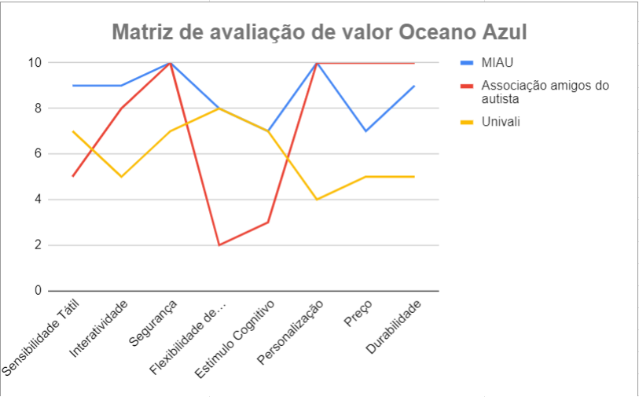
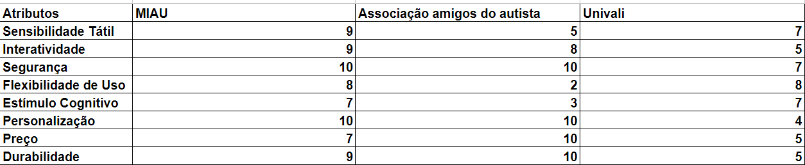

1. **Sensibilidade Tátil**
- MIAU: A alta prioridade dada à sensibilidade tátil indica um compromisso em fornecer uma experiência rica e variada, fundamental para atender às necessidades sensoriais diversificadas das crianças com TEA.
- Associação amigos do autista: A ênfase na sensibilidade parece ser balanceada, focando em texturas que são confortáveis para as crianças, mas sem uma vasta gama de sensações.
- Univalli: A inclusão de estímulos sensoriais no tapete sugere uma boa capacidade de ativação sensorial, embora não seja claro se a variedade é tão extensa quanto no MIAU.

2. **Interatividade**
- MIAU: A interatividade é provavelmente um dos recursos-chave, indicando que o tapete reage de maneira dinâmica e engajante, uma característica valiosa para a manutenção do interesse das crianças durante as sessões terapêuticas.
- Associação amigos do autista: O tapete oferece um feedback sensível às reações das crianças, promovendo uma experiência interativa que apoia a percepção e a resposta ao estímulo.
- Univalli: A descrição sugere alguma forma de resposta ao uso, mas não há detalhes que indiquem uma interatividade tão rica quanto nos outros projetos.

3. **Segurança**
- MIAU: A segurança é evidentemente um pilar do projeto, sugerindo que todos os aspectos, desde o design até os materiais, são escolhidos com o bem-estar das crianças em mente.
- Associação amigos do autista: A pontuação indica que a segurança é uma prioridade máxima, o que é esperado de um dispositivo utilizado em um contexto terapêutico.
- Univalli: A segurança parece ser assegurada, embora não seja a característica mais enfatizada, o que pode ser devido ao contexto clínico onde outras considerações também são importantes.

4. **Flexibilidade de Uso**
- MIAU: A capacidade de adaptar o tapete a diferentes situações terapêuticas sugere um design inteligente e versátil.
- Associação amigos do autista: A flexibilidade parece é limitada, devido a uma abordagem mais padronizada ou focada em um conjunto específico de necessidades.
- Univalli: A versatilidade para atender diferentes condições neurológicas e idades aponta para um tapete amplamente aplicável, o que é benéfico em um ambiente clínico diversificado.

5. **Estímulo Cognitivo**
- MIAU: A pontuação reflete um esforço para incorporar desafios que promovem o desenvolvimento cognitivo, além da estimulação sensorial.
- Associação amigos do autista: A menor pontuação indica um foco predominante na estimulação sensorial em detrimento de componentes cognitivos.
- Univalli: O tapete foi ser projetado com uma consideração para o estímulo cognitivo, o que é uma parte vital da terapia ocupacional e do desenvolvimento infantil.

6. **Personalização**
- MIAU: A alta pontuação sugere um tapete altamente personalizável, permitindo uma experiência terapêutica individualizada.
- Associação amigos do autista: A personalização é também um aspecto chave, indicando que o tapete pode ser ajustado para se adequar a diferentes preferências e necessidades.
- Univalli: O foco na personalização não é tão proeminente, devido a uma abordagem mais uniforme ou a limitações no design que não permitem ajustes tão detalhados.

7. **Preço**
- MIAU: O preço é considerado de forma a equilibrar acessibilidade e qualidade, visando oferecer um produto competitivo sem comprometer características essenciais.
- Associação amigos do autista: A acessibilidade parece ser uma preocupação central, sugerindo que o produto é posicionado para ser o mais econômico possível.
- Univalli: O custo é presumivelmente balanceado com a funcionalidade, indicando que o tapete é razoavelmente acessível, mas investimentos adicionais em qualidade e versatilidade são implícitos.

8. **Durabilidade**
- MIAU: A durabilidade é provavelmente uma das características de design, refletindo a intenção de um uso prolongado e consistente, essencial em um ambiente terapêutico.
- Associação amigos do autista: A ênfase na durabilidade indica que o tapete é construído para resistir ao uso frequente e intensivo, um aspecto importante para instituições terapêuticas.
- Univalli: A durabilidade é suficiente para o uso contínuo, mas pode não é o foco principal, o que reflete nas considerações práticas ou orçamentárias no ambiente clínico.

## Canvas de Proposta de Valor

No mundo empresarial dinâmico e altamente competitivo de hoje, compreender as necessidades e expectativas dos clientes é mais crucial do que nunca para o sucesso empresarial. O Canvas de Proposta de Valor é uma ferramenta estratégica indispensável que facilita este entendimento ao permitir que as empresas mapeiem, analisem e alinhem seus produtos ou serviços com os desejos e necessidades dos clientes.

Para ilustrar o uso do Canvas de Proposta de Valor, consideramos nossos clientes, instituições de terapia ocupacional especializadas nos cuidados de crianças com TEA. Estas instituições procuram soluções que possam apoiar o desenvolvimento de habilidades sociais e de comunicação das crianças, enquanto oferecem um ambiente interativo, lúdico, seguro e adaptativo para seu aprendizado e crescimento.

Com base nessas necessidades específicas, preenchemos um diagrama do Canvas de Proposta de Valor com o objetivo de alinhar o produto desenvolvido com as expectativas e necessidades desses clientes essenciais.

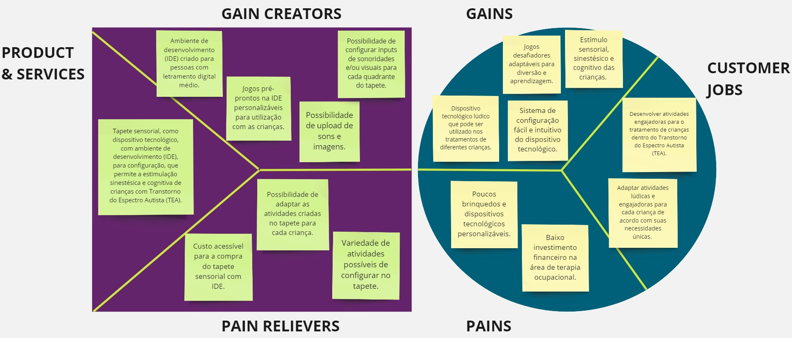

## Total Adressable Market, Service Adressable Market e Service Obtainable Market (TAM SAM SOM)

### Definição
TAM, SAM e SOM são três métricas usadas para quantificar o potencial de mercado de um produto ou serviço. TAM (Total Addressable Market) refere-se ao mercado total disponível para um produto, considerando todos os consumidores que poderiam potencialmente estar interessados na oferta. SAM (Serviceable Available Market) é a parte desse mercado que pode ser atendida pela infraestrutura e canais de distribuição atuais de uma empresa. Por fim, SOM (Serviceable Obtainable Market) representa a parcela do SAM que a empresa espera realmente capturar, levando em conta as limitações como competição e capacidade de produção. Essas métricas são essenciais para ajudar empresas a planejar estratégias de expansão e investimentos.

### Total Adressable Market (TAM)
Nosso público alvo são instituições de cuidados à crianças com TEA no Brasil. Almejamos vender para instituições e não pessoas físicas devido ao fato de que o tapete pode ser aproveitado por várias crianças e seria custoso para a família comprar um tapete para ser utilizado por uma só criança. Além disso o alvo são instituições no Brasil, pois grande parte dessas instituições são atreladas ao governo e há regras específicas de cada país para compra de produtos por parte de instituições governamentais. 
Assim, para calcular nosso TAM, iremos pelo caminho de estimar quantas crianças, de 5 a 7 anos e com TEA, passam por esse tipo de instituição diariamente no Brasil, e quantas crianças um tapete conseguiria abranger por dia, descobrindo assim quantos tapetes poderiam ser vendidos no total. 
Segundo o site omundoautista.uai, hoje não temos dados concretos sobre a prevalência do transtorno no Brasil, mas podemos utilizar uma das principais pesquisas sobre o tema, realizada com crianças de 8 anos nos Estados Unidos, para ter uma estimativa aproximada. A pesquisa, feita pela CDC (Centers for Disease Control and Prevention) em 2023, indica que uma a cada 36 crianças estão no espectro autista.
 
Agora, para descobrir a quantidade de crianças de 5 a 7 anos no Brasil, podemos utilizar a pirâmide etária abaixo.

  

Analisando a pirâmide, podemos concluir que, como aproximadamente 3,5% da população possui idade entre 5 e 9 anos, por volta de 1,75% possui idade de 5 a 7. Dado que o Brasil possui 215 milhões de pessoas, estimamos que hajam por volta de 3.762.500 crianças nessa faixa etária no Brasil. Como 1 em 36 crianças estão no espectro, como concluído anteriormente, assumimos que hajam 104.513 crianças dessa faixa etária com TEA.
 
Supomos que duas a cada três crianças dessas crianças frequentem algum tipo de instituição com cuidados especiais para crianças com TEA (nosso público alvo), e que as crianças que frequentam essas instituições fazem isso, em média, uma vez por semana, como citado pela dra. Marília, parceira do projeto. Assim, a fim de descobrir a quantidade de crianças que passam por instituições especializadas em um determinado dia, fazemos 104.513 x 0,66 x 0.2 = 13.795 crianças.
 
Sabendo que 13.795 crianças passam diariamente por centros que seriam nosso público alvo, precisamos descobrir quantos tapetes poderiam ser vendidos, a partir dessa informação. Assumindo que esses centros ficam abrtos, em média, 8 horas por dia, e que uma criança possa brincar com o tapete por volta de duas horas por dia, percebemos que um tapete pode contemplar as necessidades de 4 crianças em um dado dia, assim, para saber quantos tapetes poderiam ser potencilamente vendidos: 13.795 / 4 =~ 3.450 tapetes.
 
Como cada tapete seria vendido por R$ 709,04, realizando a multiplicação de preço por quantidade, chegamos no valor de R$ 2.446.188. Assim, nosso Total Adressible Market seria de 2 milhões 446 mil 188.
 
Algumas ressalvas com relação ao Tam: Ele poderia ser tranquilamente aumentado caso expandissemos a faixa etária de utilização do tapete de 5 a 7 para 4 a 11, por exemplo. Ele também poderia ser aumentado se vendessemos para pessoas físicas, além das instituições. Contudo, resolvemos deixar o público alvo bem específico, para obter os melhores resultados e superar a competição.

### Service Adressable Market (SAM)

No caso do nosso produto, acreditamos que a principal diferença entre o TAM e o SAM será a capacidade de investimento das instituições compradoras. Voltando para o nosso cálculo efetuado no TAM, supondo que uma instituição cuida de 100 crianças e que cada uma delas vai uma vez por semana, passariam cerca de 20 crianças por dia nessa instituição. Como estimamos que um tapete possa acomodar 4 crianças em um determinado dia, essa instituição teria que comprar 5 tapetes idealmente. Com cada tapete custando R$ 709,04, o custo total seria de aproximadamente 3500 reais. Pode parecer caro, mas efetuando a conta por criança, sabendo que há 100 crianças, o investimento total é de 35 reais por criança.
 
Esse número pode não parecer tão alto, mas dado que grande parte dos nosso clientes seriam instituições públicas, nossa hipótese é de que 25% dessas instituições com cuidados especiliazados para crianças com TEA não conseguiriam investir no tapete.
 
Assim nosso SAM é 75% do SAM, totalizando R$1.834.641.

### Service Obtainable Market (SOM)

Para realizar o cálculo do SOM levaremos em conta capacidade de distribuição, capacidade de marketing, e competição.
 
Em termos de capacidade de distribuição, não haveria problema entregar em qualquer lugar do Brasil. O Tapete é um produto de alto valor agregado e, portanto, o valor a ser pago em frete seria baixo em comparação. A dificuldade de abranger em todo o Brasil viria das áreas de marketing e comercial. A forma como esperamos vender nosso produto é indo até os potenciais clientes e mostrando o tapete. Acreditamos que dada a natureza do nosso negócio, essa forma seria muito mais efetiva do que camapanhas de marketing. Com isso em mente, seria difícil executar essa estratégia fora do estado de São Paulo no anos iniciais do projeto.
 
Assim, dado que São Paulo concentra 20% da população brasileira, podemos estimar grosseiramente que SOM fica limitado a 20% do SAM, sendo, no máximo, R$ 366.930.
 
Outra coisa que poderia reduzir o SOM seria a concorrência, mas, como demonstrado na análise do Oceano Azul, o mais próximo que há em termos de concorrência ainda possui uma proposta bem diferente da nossa, e sinto que muito raramente um cliente deixaria de comprar por ter sua necessidade suprida por um concorrente.
 
Dito isso, R$ 366.930 seria a fatia de mercado que esperaríamos obter nos primeiros anos de negócio, o equivalente a cerca de 500 tapetes.

## Matriz de risco

A matriz de risco, também conhecida como matriz de probabilidade e impacto, é uma ferramenta de gerenciamento de riscos amplamente utilizada em projetos, empresas e diversas situações de planejamento. O objetivo principal da matriz é ajudar a avaliar e priorizar riscos com base em dois fatores fundamentais:

Probabilidade: A frequência esperada ou a chance de um risco ocorrer.
Impacto: A gravidade das consequências caso o risco se concretize.

Ela permite aos gestores visualizar e priorizar os riscos com base em sua probabilidade de ocorrência e impacto potencial no projeto, o que facilita a tomada de decisões informadas e o desenvolvimento de estratégias de mitigação eficazes.

A criação de uma matriz de risco dedicada para cada componente do projeto — a IDE, o tapete sensorial e a equipe — é fundamental, visto que cada um possui conjuntos de riscos e oportunidades distintos. Este nível de detalhamento garante que os planos de ação sejam precisos e alinhados com os desafios específicos enfrentados por cada segmento. 

Para a IDE, consideramos fatores como a usabilidade, confiabilidade do software e segurança de dados, que são críticos para a aceitação e eficácia do tapete sensorial. A matriz ajuda a identificar os desafios tecnológicos que podem impedir a adoção da ferramenta pelos terapeutas ou que podem comprometer a integridade dos dados dos pacientes.

O tapete sensorial, como um dispositivo interativo destinado a pacientes com TEA, apresenta seus próprios riscos, relacionados principalmente à sua aceitação, eficácia terapêutica e segurança. A matriz permite avaliar riscos que podem não apenas afetar a viabilidade técnica do tapete, mas também a sua aceitação no mercado e a percepção do público.

Por fim, a equipe por trás do projeto é o alicerce sobre o qual todo o desenvolvimento se apoia. Riscos relacionados à coesão da equipe, competências técnicas e capacidade de gestão de projetos podem ter um impacto profundo no sucesso geral do projeto. Entender e planejar para esses riscos humanos e operacionais é tão importante quanto para os técnicos.

## Riscos
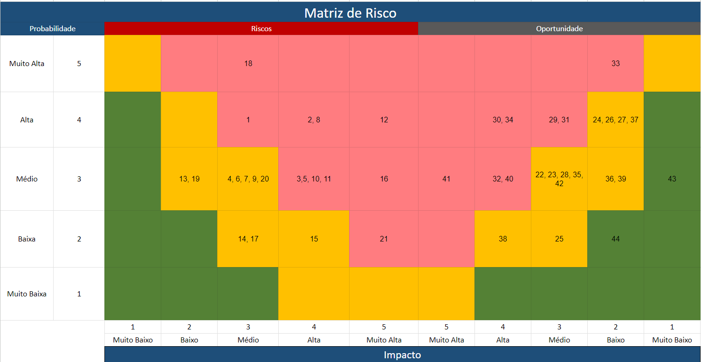
Fonte: Elaborado pela equipe

### Considerando a IDE
1.  **Complexidade da Interface**: Dificuldade de uso por terapeutas sem conhecimento técnico.
2. **Falhas de Software**: Bugs que podem levar a programações incorretas do tapete.
3. **Atualizações de Software**: Necessidade de atualizações frequentes.
4. **Formação de Terapeutas**: Necessidade de treinamento extensivo para uso efetivo da IDE.
5. **Segurança de Dados**: Riscos com a privacidade dos dados do paciente.
6. **Adoção Tecnológica**: Resistência à adoção de novas tecnologias.
7. **Dependência Tecnológica**: Dependência excessiva de tecnologia pode afetar a terapia.

### Considerando o Tapete Sensorial
8. **Obsolescência Tecnológica**: Emergência de novas tecnologias pode rapidamente tornar o tapete sensorial obsoleto.
9. **Resistência à Mudança**: Terapeutas e clientes podem preferir métodos terapêuticos convencionais.
10. **Problemas de Qualidade**: Falhas nos primeiros lotes podem prejudicar a reputação do produto.
11. **Segurança do Produto**: Riscos de lesões ou danos durante o uso do tapete.
12. **Não Conformidade do Paciente**: Desafios com a adesão ao tratamento podem diminuir a eficácia.
13. **Resposta Individual Variável**: Pacientes podem reagir negativamente ao estímulo do tapete.
14. **Manutenção e Higiene**: Desafios relacionados à limpeza e manutenção se usado por múltiplos pacientes.
15. **Integração com Terapias Existentes**: Dificuldades em harmonizar o tapete com métodos terapêuticos pré-existentes.

### Para a Equipe como uma Empresa
16. **Coesão da Equipe**: Importância de manter uma boa comunicação e alinhamento.
17. **Competências Técnicas**: Necessidade de habilidades técnicas específicas na equipe.
18. **Gestão de Projetos**: Eficiência em planejamento e gestão de recursos.
19. **Adesão às Normativas**: Cumprimento das regulamentações do setor.
20. **Escalabilidade**: Desafios na transição para produção em larga escala.
21. **Satisfação do Cliente**: Necessidade de atender às expectativas e incorporar feedbacks.

## Oportunidades

### Considerando o Tapete Sensorial
22. **Parcerias com Instituições de Ensino**: Colaboração com escolas e centros especializados.
23. **Inovação Tecnológica**: Desenvolvimento de tecnologia que pode ser licenciada.
24. **Tendência de Personalização**: Demanda por terapias personalizadas.
25. **Educação e Treinamento**: Oferta de programas certificados para terapeutas.
26. **Publicidade Positiva**: Uso de testemunhos e histórias de sucesso.
27. **Produtos Complementares**: Desenvolvimento de produtos que complementem o tapete.
28. **Pesquisa e Desenvolvimento**: Inovações que podem melhorar o produto.
29. **Engajamento Familiar**: Uso do tapete como ferramenta de envolvimento na terapia.
30. **Feedback Imediato**: Capacidade de feedback em tempo real.
31. **Desenvolvimento de Habilidades**: Contribuição no desenvolvimento motor e cognitivo.

### Considerando a IDE
32. **Personalização do Tratamento**: Melhoria nos resultados terapêuticos.
33. **Eficiência do Terapeuta**: Ajustes rápidos e fáceis no tratamento.
34. **Integração com Outras Ferramentas**: Potencial de integração com softwares existentes.
35. **Dados para Pesquisa e Desenvolvimento**: Coleta de dados sobre eficácia dos tratamentos.
36. **Educação e Treinamento**: Programas de educação e certificação.
37. **Expansão de Funcionalidades**: Adição de novas funcionalidades através de software.
38. **Parcerias Estratégicas**: Colaboração com desenvolvedores de software e instituições acadêmicas.

### Para a Equipe como uma Empresa
39. **Cultura de Inovação**: Promoção de uma cultura focada em inovação.
40. **Rede de Contatos**: Expansão da rede de contatos no setor de saúde e tecnologia. 
41. **Parcerias Acadêmicas:** Estabelecimento de colaborações com instituições acadêmicas para pesquisa e desenvolvimento.
42. **Expansão de Mercado:** Exploração de novos mercados e nichos para o tapete sensorial e a IDE.
43. **Diversificação de Produtos:** Desenvolvimento de variações do tapete sensorial para diferentes aplicações terapêuticas.
44. **Tecnologia Proprietária:** Criação de tecnologias exclusivas que ofereçam vantagens competitivas e possibilidades de licenciamento.

## Análise financeira

A análise financeira tem como objetivo calcular os custos de produção do tapete sensorial, fazer uma projeção de receitas e ver a viabilidade do projeto.

### Custos

Os custos se dividem em 3 categorias:
   - Componentes
   - Ferramentas
   - Software

#### Componentes:

Nessa parte foram calculados os custos dos componentes que integram o tapete sensorial.

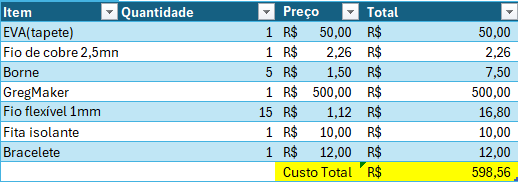

- O custo total dos componentes é de **R$598,56**

#### Ferramentas

Para fazer a manufatura do tapete são necessárias ferramentas que serão utilizadas na montagem, os seus respectivos custos estão na planilha abaixo.

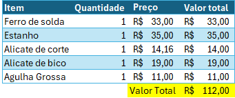

- O custo total dos componentes é de **R$112,00**

#### Software:

Para desenvolver a IDE é necessário um time de tecnologia, para a análise coloquei como parâmetro 1 programador sênior e 1 programdor junior trabalhando por 2 meses (tempo do projeto).

  

- O custo total de software é de **R$27.000,00**

### Projeção de receitas:

Para projetar a receita vamos contabilizar a venda de 500 tapetes (numero obtido na análise do SOM).
Após isso temos que unificar os custos de componentes e software para calcular o investimento necessário  
e dividir pela quantidade produzida para calcular o custo por tapete.

### Unificando os custos e projetando investimento necessário:

Os custos para a produção incluem componentes e software, as ferramentas não serão inclusas ja que são um investimento de capital (CAPEX).  
Para unificar os custos temos que somar o custo de software, que será fixo, aos custos dos componentes que serão calculados por   
unidade e dividir pela quantidade de tapetes produzidos, aí teremos o custo por tapete e o investimento necessário.

#### Passo 1: Cálculo do Custo Fixo de Software
O custo de software é um valor fixo, independente da quantidade de tapetes produzidos.

#### Passo 2: Cálculo do Custo Variável de Componentes por Unidade
Os componentes possuem um custo que é calculado por unidade. Este custo varia de acordo com a quantidade de tapetes produzidos. Quanto mais tapetes produzidos, maior será o custo total desses componentes.

#### Passo 3: Unificação dos Custos
Para determinar o custo total por tapete, somamos o custo fixo de software ao custo total dos componentes e dividimos essa soma pelo número total de tapetes produzidos.  
Dessa forma temos o custo de produção por tapete e o investimento necessário.

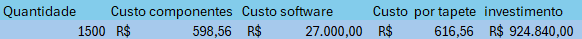

- Custo por tapete: **R$616,56**
- Investimento necessário: **R$924.840,00**

#### Precificação:

Para chegar a um preço de venda do tapete foi estimada uma margem de 15% sobre o custo de produção.
   - O calculo fica assim:
   - **Preço de venda = Custo produção x (1 + Margem)** 

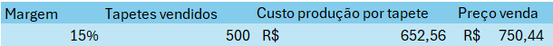

   - Preço de venda final: **R$750,44**

### Projetando Receita:

Agora que temos o preço de venda final e a quantidade de tapetes vendidos é possivel projetar nossa DRE.  
A DRE é uma demonstração contábil que permite ver o desempenho financeiro de uma empresa em um determinado período.

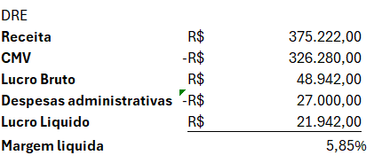

   - **Receita: R$375.000,22**
   - **Lucro Líquido: R$21.942,00**

### Análise de viabilidade:

No planejamento empresarial é muito importante calcular o break even para ver a viabilidade do projeto ,também conhecido como ponto de equilíbrio.      
o Break Even é um ponto onde o valor das vendas é igual ao valor de custo e consequentemente a margem líquida é 0%.
Após feita a análise é possível saber o quanto precisa ser vendido para a receita cobrir os custos da operação.

### Calculando Break Even:
Utilizando a função "Goal Seek" do excel é possível calcular exatamente quantos tapetes precisam ser vendidos para atingir o break even.

#### Passo 1: Definir celula variável.
Como o objetivo é calcular quantos tapetes precisam ser vendidos, colocamos a celula de tapetes vendidos no campo "Alternando célula".

#### Passo 2: Definir célula fixa:
No campo "definir celula" basta colocar a célula que representa o lucro líquido.

#### Passo 3: definir valor:
Neste campo, especificamos o valor "0" para o lucro/prejuízo total, assim teremos o break even.

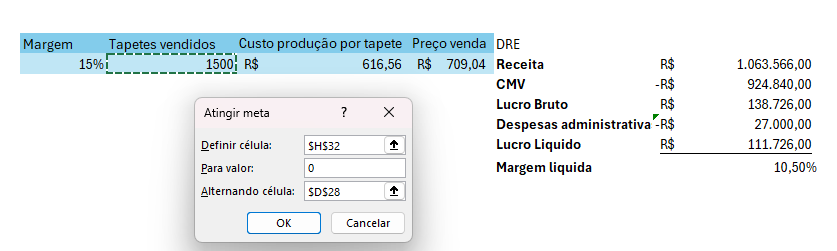

### Resultado:

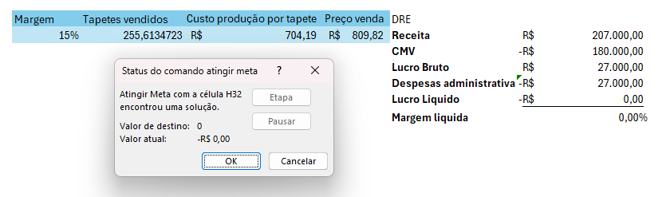

   - Como é mostrado na imagem, para atingir o break even, precisam ser vendidos **256 tapetes**.
