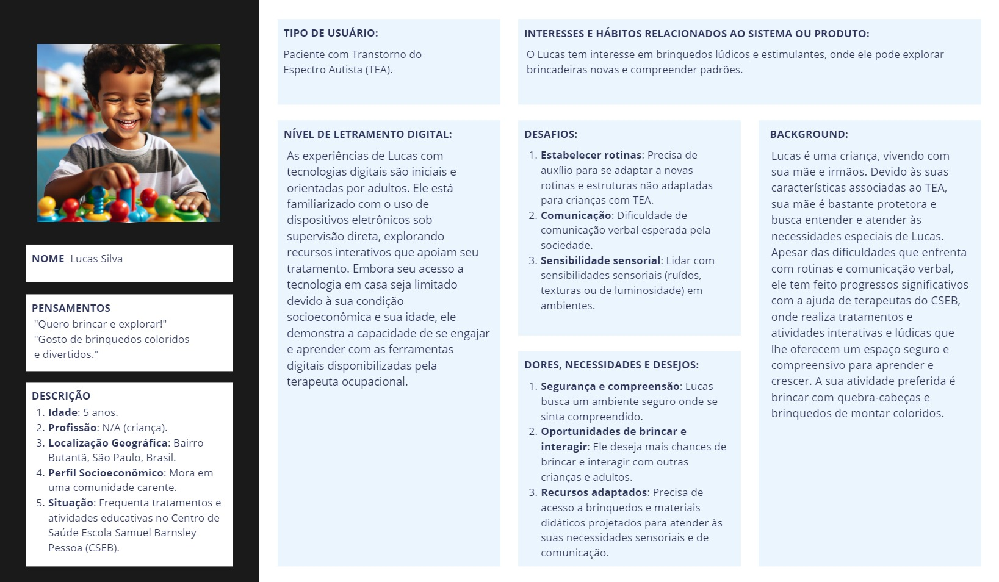
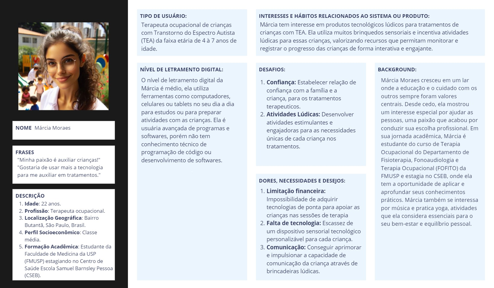
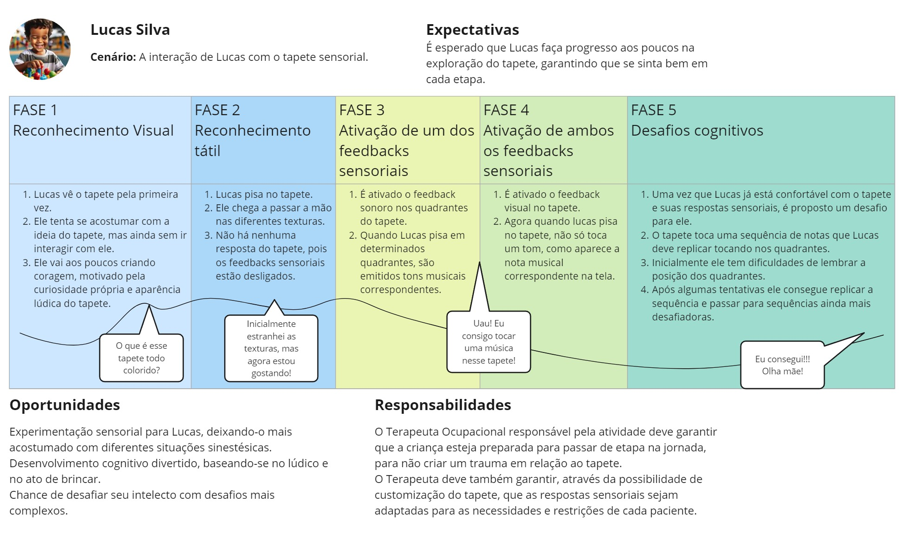
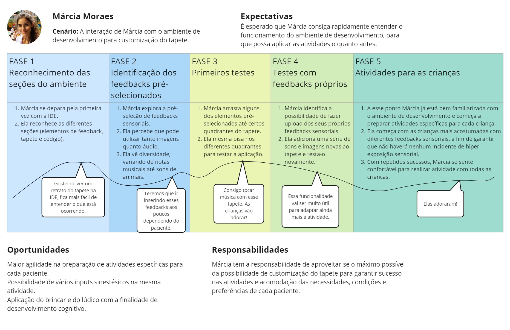

# Entendimento do Usuário

## Personas

## Definição

As *personas* são representações fictícias, mas detalhadas, de usuários alvos de um produto ou serviço. Elas são criadas com base em pesquisas e dados reais sobre o público-alvo e ajudam as equipes de desenvolvimento a entenderem melhor as necessidades, experiências, comportamentos e objetivos dos usuários. A criação de personas ajudam a moldar a *jornada do usuário* e as *User Stories*, assegurando que todas as funcionalidades propostas do produto final sejam relevantes e benéficas para os usuários em diferentes cenários de uso.

No contexto deste projeto, apresentamos duas personas principais: Lucas e Márcia, cada um representando diferentes aspectos e necessidades dos usuários finais. 

### Persona 1 (Lucas): 

### Persona 2 (Márcia):

## Jornada do usuário

### Definição

A *jornada do usuário* é um conceito fundamental no design de experiências, que mapeia o caminho completo que um usuário percorre ao interagir com um produto ou serviço. O objetivo de entender a *jornada do usuário* é identificar oportunidades de melhoria, eliminar pontos de fricção e otimizar a experiência geral. Ao fazer isso, as empresas podem criar produtos mais intuitivos e serviços mais satisfatórios, fidelizando clientes e promovendo um engajamento mais profundo.

### Jornada 1 (Lucas):

### Jornada 2 (Márcia):

## User Stories

### Definição

As *User Stories* são uma técnica ágil de captura de requisitos que coloca as necessidades do usuário no centro do processo de desenvolvimento. Essencialmente, são descrições curtas e simples do que o usuário deseja alcançar ao usar um produto, escritas e pensadas a partir da perspectiva do próprio usuário. Cada *User Story* é formulada de forma a esclarecer o que o usuário precisa, por que precisa e como isso pode agregar valor ao seu trabalho. Este método ajuda a alinhar quais as expectativas sobre o produto desenvolvido, além de listar as funcionalidades essenciais requeridas.

### User Stories da Terapeuta Ocupacional
 

**Customização de Atividades**
 

1. Eu, como terapeuta ocupacional, quero uma interface que me permita customizar a atividade com base no tratamento para atender as necessidades específicas de cada paciente.
 

**Facilidade de Uso** 

2. Eu, como terapeuta ocupacional, quero poder utilizar uma interface simples e intuitiva para poder utilizar sem conhecimento técnico de programação.
 

**Seleção de Elementos do Tapete** 

3. Eu, como terapeuta ocupacional, quero escolher quais sons, imagens e cenários de cada quadrante do tapete para atender o tratamento do paciente.
 

**Salvamento de Configurações** 

4. Eu, como terapeuta ocupacional, quero poder salvar as escolhas de customização do tapete para economizar tempo.
 

**Registro de Atividades** 

5. Eu, como terapeuta ocupacional, quero ter a possibilidade de salvar uma descrição da realização da atividade pelo paciente para poder acompanhar a evolução dele.
 

**Reforço para Salvamento de Informações** 

6. Eu, como terapeuta ocupacional, quero que o programa reforce a necessidade de salvar as configurações do tapete e a descrição da atividade para que não haja a possibilidade de eu perder o registro.
 

**Elementos Pré-definidos** 

7. Eu, como terapeuta ocupacional, quero que já tenha elementos pré-definidos para ter a personalidade do desenvolvedor.
 

**Gamificação das Atividades** 

8. Eu, como terapeuta ocupacional, quero ter a opção de transformar a atividade em um jogo para pacientes que precisam de um desafio para se manterem engajados possam ser contemplados.
 

### User Stories da Criança
 

**Conforto do Tapete** 

1. Eu, como paciente, quero que a superfície do tapete seja confortável para que eu não me machuque.
 

**Exploração do Tapete** 

2. Eu, como paciente, quero poder explorar o tapete e suas funcionalidades para que meu tempo de adaptação seja respeitado.
 

**Experiência Lúdica** 

3. Eu, como paciente, quero que minha experiência seja lúdica para que eu continue engajado.
 

**Customização da Atividade** 

4. Eu, como paciente, quero que a atividade no tapete seja customizável para que respeite meus limites.
 